# Hospital Management System

[](https://dotnet.microsoft.com/download/dotnet/8.0)
[](https://github.com/XREFS0/XREFS0-Hospital-Management-System)
[](https://www.sqlite.org/)
[](LICENSE)

A complete desktop **Hospital Management System** built with **C# (.NET 8 Windows Forms)** and **SQLite**. It provides role-based portals for administrators, doctors and patients, covering the full clinical workflow: patient and doctor records, appointment scheduling with conflict detection, billing and payment tracking, medical records, and operational reports.

The application is **zero-configuration**: on first launch it creates a local `hospital.db` file (schema plus realistic seed data) next to the executable. No database server installation or connection-string setup is required.

## Table of Contents

- [Features](#features)
- [Tech Stack](#tech-stack)
- [Screenshots](#screenshots)
- [Getting Started](#getting-started)
- [Default Login Credentials](#default-login-credentials)
- [Database](#database)
- [Project Structure](#project-structure)
- [Configuration](#configuration)
- [Troubleshooting](#troubleshooting)
- [License](#license)
- [Authors](#authors)

## Features

**Role-based access**

- Admin portal with live statistics (patients, doctors, appointments, unpaid bills)
- Doctor portal to review personal appointments and update their status with validated transitions (Scheduled to Completed/Cancelled, Completed to Closed)
- Patient portal to view personal appointments, bills, amounts paid and remaining balances (read-only)

**Clinical and administrative modules**

- Patient management: add, update, delete and search (name, CNIC, contact) with duplicate-CNIC protection
- Doctor management: add, update, delete and search by name or specialization
- Appointment scheduling: book, update and cancel appointments with double-booking detection per doctor, date and time
- Billing: generate bills linked to appointments, track Paid/Unpaid status with color-coded rows
- Payments: record full or partial payments, automatic balance calculation, overpayment prevention, automatic Paid marking when a bill is settled
- Medical records: full history per patient (diagnosis, treatment, prescription, record date)
- Reports: patient visit summary, billing summary with paid/balance columns, appointment status report

**Technical highlights**

- Single-file SQLite database, created and seeded automatically on first run
- Centralized data-access layer (`DBHelper`) with parameterized queries
- Unified professional UI theme applied to every form (`Theme`)
- Idempotent seed logic: safe to run on every startup without duplicating data

## Tech Stack

| Layer      | Technology                                      |
| ---------- | ----------------------------------------------- |
| Language   | C# 12                                           |
| Framework  | .NET 8 (Windows Forms)                          |
| Database   | SQLite (via Microsoft.Data.Sqlite 8.x)          |
| Data access| ADO.NET helper class (`DBHelper`)               |
| UI styling | Centralized WinForms theme (`Theme`)            |
| Architecture | 3-tier: presentation, business logic, data   |

## Screenshots

### Login

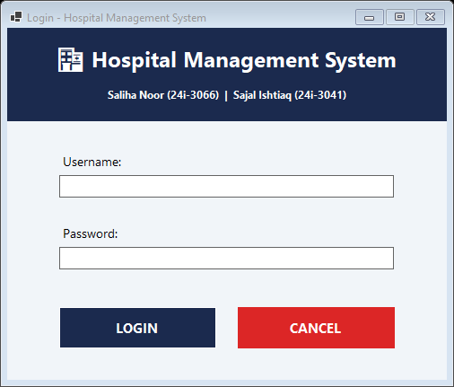

### Admin dashboard

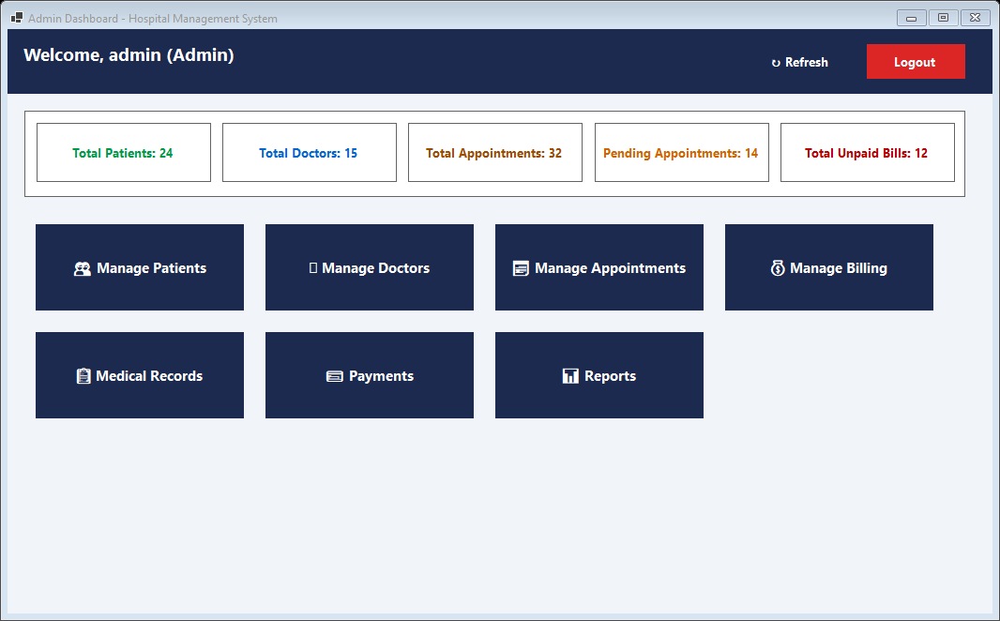

### Patient management

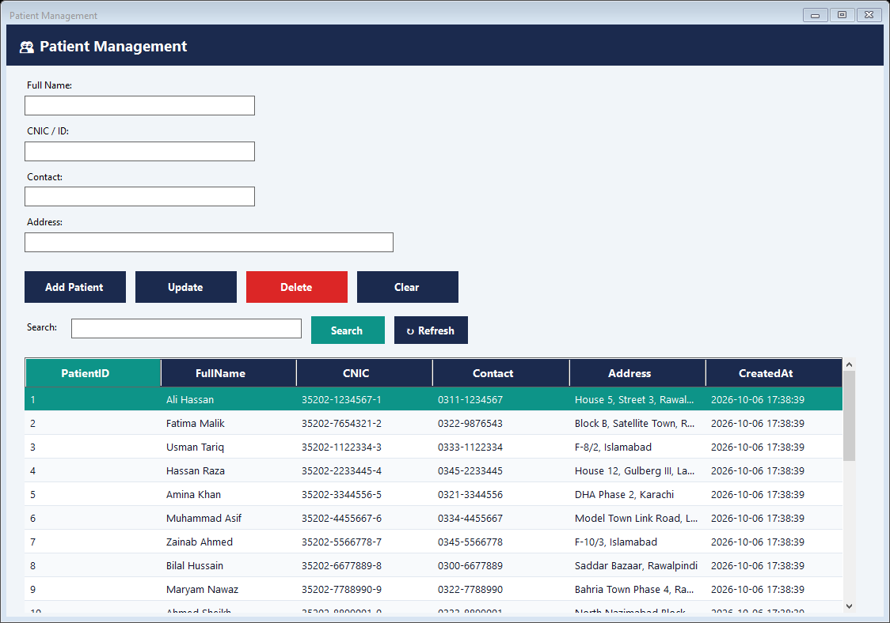

### Doctor management

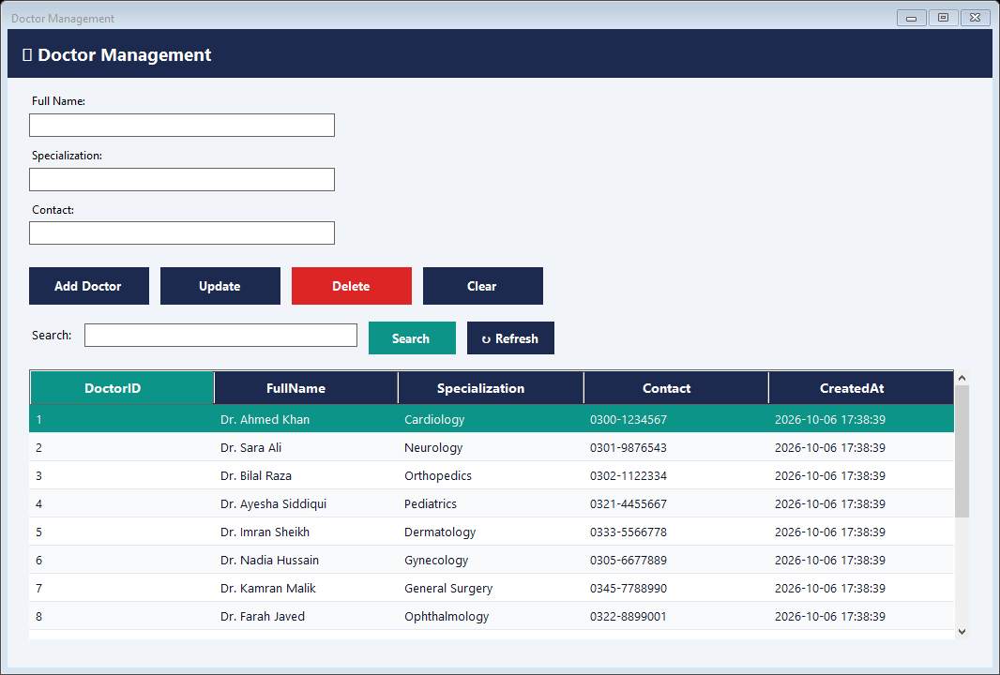

### Appointment management

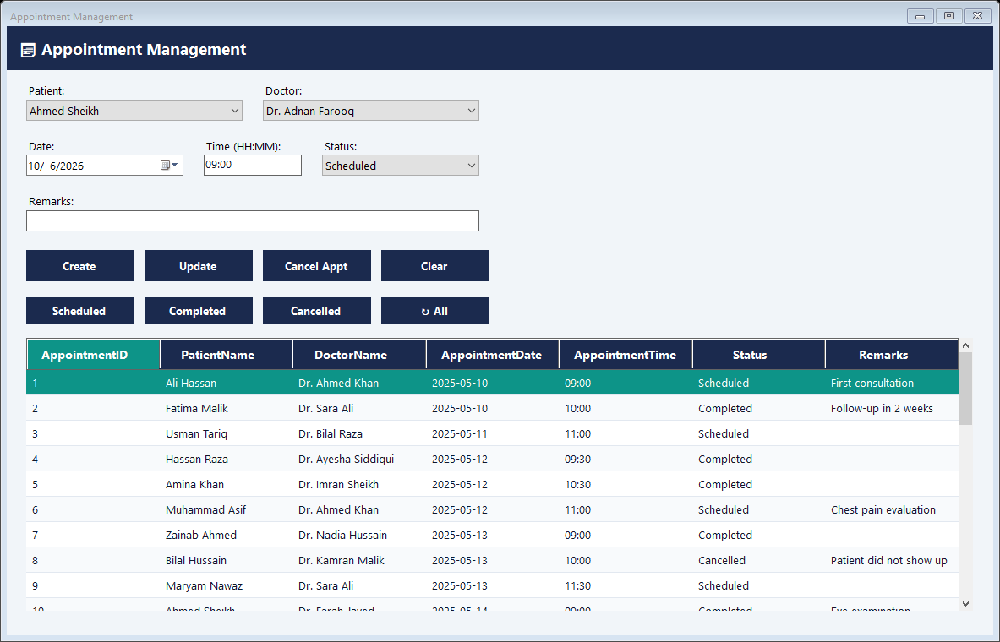

### Billing

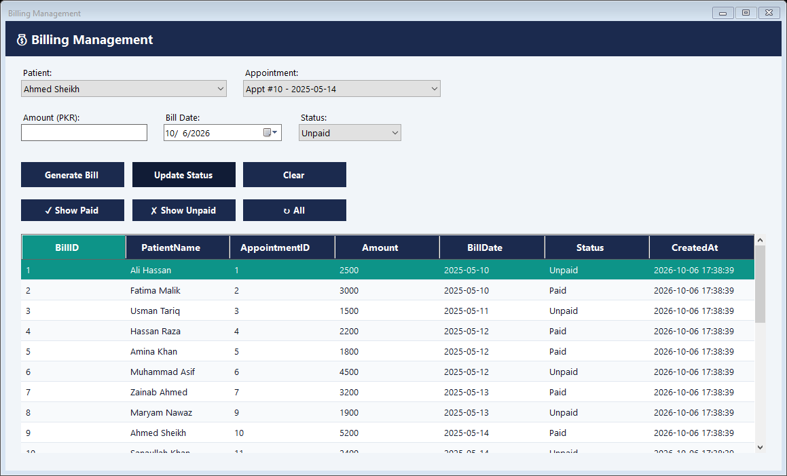

### Medical records

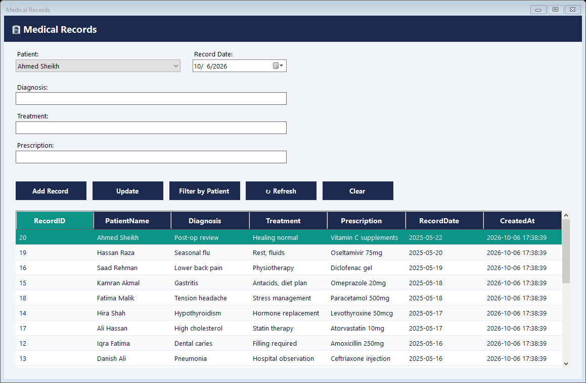

### Payments

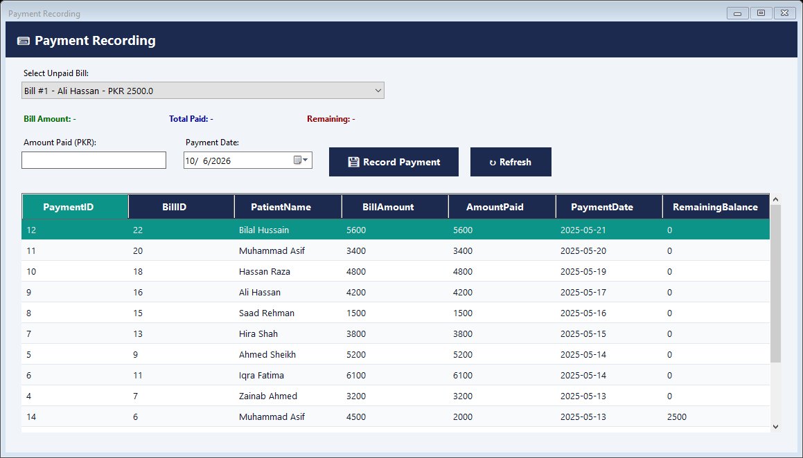

### Reports

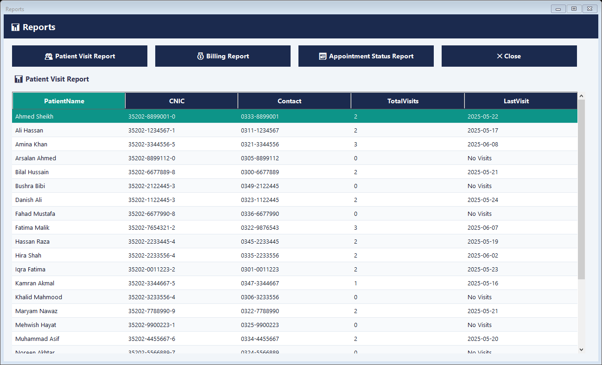

### Doctor portal

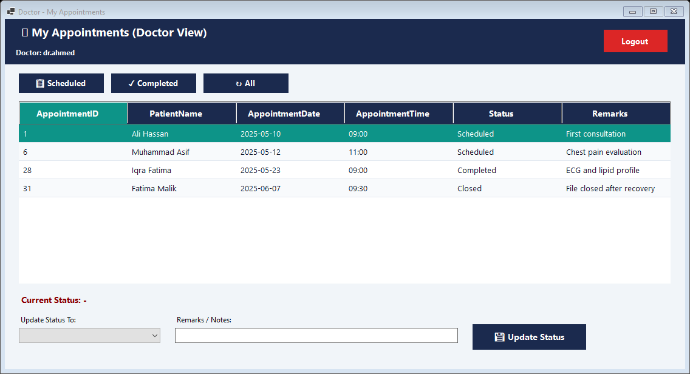

### Patient portal

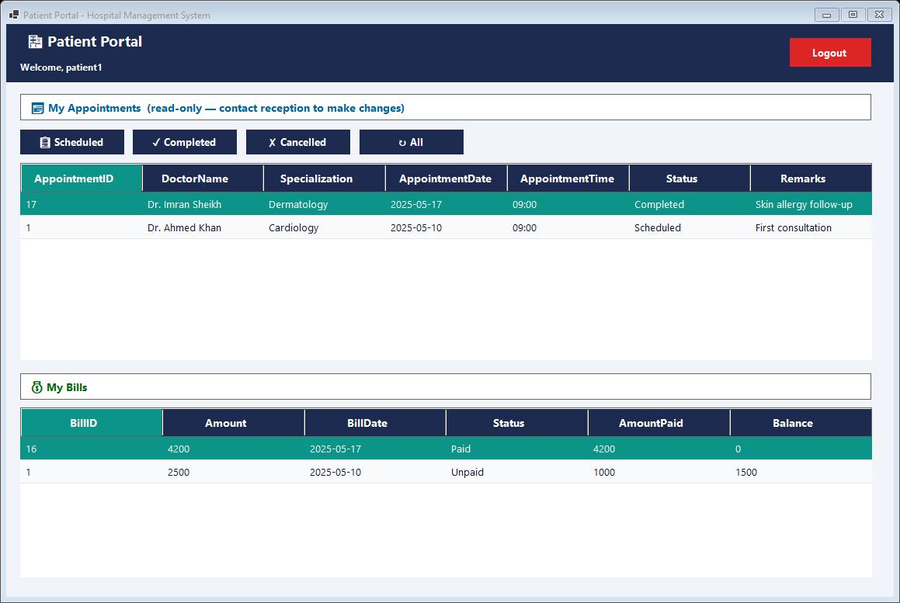

## Getting Started

### Prerequisites

- Windows 10 or later (x64)
- To build from source: [.NET 8 SDK](https://dotnet.microsoft.com/download/dotnet/8.0)
- To run a published build only: [.NET 8 Desktop Runtime](https://dotnet.microsoft.com/download/dotnet/8.0)

### Option A: run the latest release

1. Open the [Releases](../../releases) page and download the latest `HospitalManagement-win-x64.zip`.
2. Extract it to any folder.
3. Run `HospitalManagement.exe`.
4. On first launch, `hospital.db` is created automatically in the same folder.

### Option B: build from source

```bash
git clone https://github.com/XREFS0/XREFS0-Hospital-Management-System.git
cd XREFS0-Hospital-Management-System
dotnet build HospitalManagement.sln -c Release
```

Run the application:

```bash
dotnet run --project HospitalManagement/HospitalManagement.csproj
```

Or open `HospitalManagement.sln` in Visual Studio 2022 (v17.8 or later) and press F5.

## Default Login Credentials

The seed data includes one administrator, six doctor accounts and five patient accounts:

| Role    | Username   | Password |
| ------- | ---------- | -------- |
| Admin   | admin      | admin123 |
| Doctor  | dr.ahmed   | doc123   |
| Doctor  | dr.sara    | doc456   |
| Doctor  | dr.bilal   | doc789   |
| Doctor  | dr.ayesha  | doc321   |
| Doctor  | dr.imran   | doc654   |
| Doctor  | dr.nadia   | doc987   |
| Patient | patient1   | pat123   |
| Patient | patient2   | pat456   |
| Patient | patient3   | pat789   |
| Patient | patient4   | pat321   |
| Patient | patient5   | pat654   |

## Database

- Engine: SQLite, file `hospital.db` located next to the executable.
- Creation: `DBHelper.EnsureDatabase()` runs on every startup; it creates tables with `IF NOT EXISTS` and applies an idempotent seed (15 doctors, 24 patients, 32 appointments, 20 medical records, 24 bills, 14 payments, 12 user accounts).
- Manual setup (optional): the same schema and seed are available as a script for any SQLite client:

```bash
sqlite3 hospital.db < HospitalManagement/Database.sql
```

- Schema overview:

| Table          | Purpose                                              |
| -------------- | ---------------------------------------------------- |
| Users          | Login accounts with role and linked record reference |
| Patients       | Patient master data (CNIC is unique)                 |
| Doctors        | Doctor master data with specialization               |
| Appointments   | Scheduled visits (unique per doctor, date and time)  |
| MedicalRecords | Diagnosis, treatment and prescription history        |
| Billing        | Bills linked to appointments with Paid/Unpaid status |
| Payments       | Payments recorded against bills                      |

- To reset to a fresh database, close the application, delete `hospital.db`, and start the application again.

## Project Structure

```text
HospitalManagement.sln
HospitalManagement/
  HospitalManagement.csproj   # SDK-style project, Microsoft.Data.Sqlite reference
  Program.cs                  # Entry point, initializes the database
  DBHelper.cs                 # Connection handling, schema creation, seed data
  Theme.cs                    # Centralized professional UI theme
  Database.sql                # Standalone SQLite schema + seed script
  LoginForm.cs                # Authentication
  AdminDashboard.cs            # Admin overview and navigation
  PatientForm.cs              # Patient CRUD and search
  DoctorForm.cs               # Doctor CRUD and search
  AppointmentForm.cs          # Appointment booking with conflict detection
  BillingForm.cs              # Bill generation and status management
  PaymentForm.cs              # Payment recording with balance calculation
  MedicalRecordForm.cs        # Medical history management
  ReportsForm.cs              # Visit, billing and appointment reports
  DoctorAppointmentForm.cs    # Doctor portal
  PatientDashboard.cs         # Patient portal
screenshots/                  # Application screenshots used above
LICENSE
```

## Configuration

No configuration is required. There are no connection strings, no `App.config` settings and no external services. The database path is resolved at runtime to `hospital.db` in the application directory.

## Troubleshooting

| Problem | Solution |
| ------- | -------- |
| `hospital.db` is locked or corrupted | Close the app, delete `hospital.db`, and restart to regenerate it. |
| Windows SmartScreen warning on first run | This is expected for unsigned desktop apps; choose "More info" then "Run anyway". |
| The app does not start (published build) | Install the .NET 8 Desktop Runtime (x64) and try again. |
| Build error about missing `Microsoft.Data.Sqlite` | Run `dotnet restore` with internet access, then rebuild. |
| Empty dropdowns or grids | Restart the app so the seed completes; check that `hospital.db` is writable in its folder. |

## License

This project is licensed under the MIT License. See the [LICENSE](LICENSE) file for details.

## Authors

- Saliha Noor (24i-3066)
- Sajal Ishtiaq (24i-3041)

Developed as an Open Ended Lab (OEL) course project at FAST NUCES.
